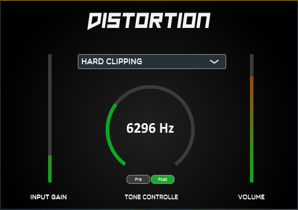

# README

## Project Description
This audio plugin was developed with Juce.
Distortion applies a non-linear trasformation to the signal and in order to give to user more possibilites different algorithms were implemented.
Input gain is used to controll the amount of distortion, insted with output gain is possibile to controlle the output level.
A IIR filter can be used to control the tone of the output sound as well, changing its cut-off frequency.
Further details on the implementation are avaible on the Report.

## Audio Example
[test audio](https://raw.githubusercontent.com/Lorenzoncina/JuceDistortionPlugin/master/Examples/Alesis-Fusion-C3%20-%20Clean.wav)

## Report (WIP)
The report source can be found over at [Overleaf](https://www.overleaf.com/7977586355htyzcgvxndwf).
